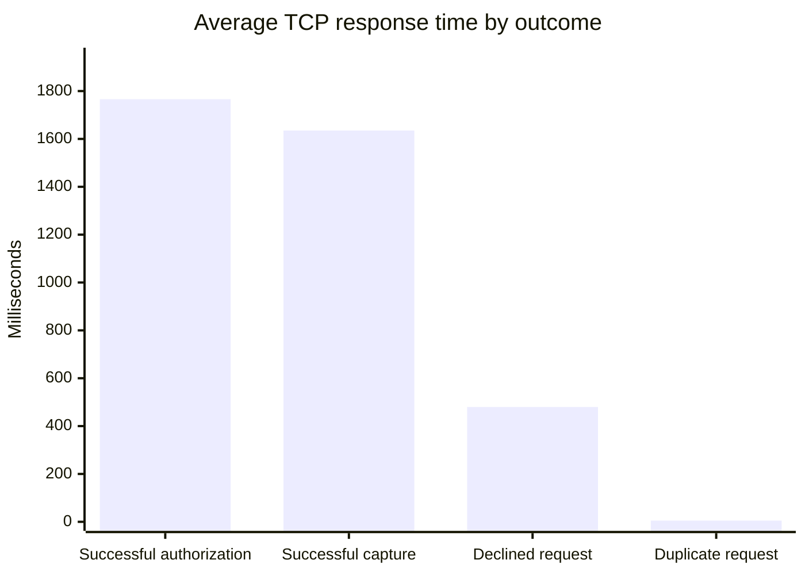
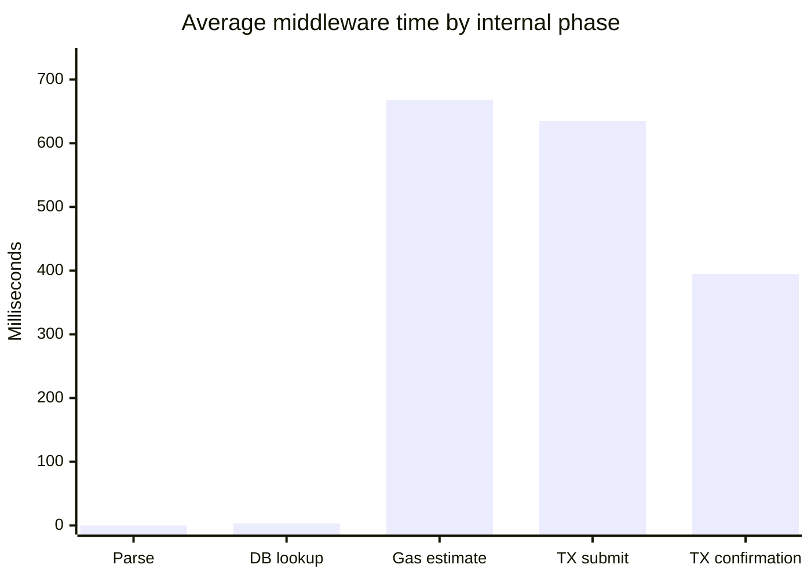
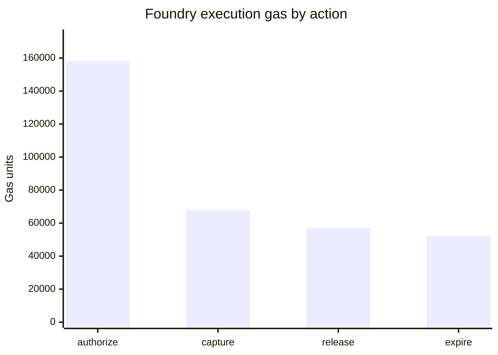
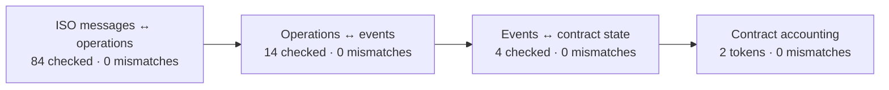

# Technical Milestone Report — M3 PoC

Generated: 2026-07-31T21:42:28.794Z

## Executive Summary

| Item | Result |
|---|---|
| Environment | Arbitrum Sepolia / controlled middleware staging |
| Settlement proxy | 0xAaE3116210b866f00ccf8dCbD540A6Cc5d070d72 |
| Environment validation | chain 421614; 4/4 roles; relayer key match true; paused false; 2 tokens checked |
| Scenario execution | 6/6 passed |
| Reconciliation | 0 mismatches |
| Security static analysis | 0 Slither findings |

## Implemented Architecture

The PoC receives ISO 8583 over a two-byte-length-prefixed TCP connection, parses
and normalizes card/merchant identifiers through PostgreSQL, performs a dry-run
gas estimate, submits through the relayer, waits for Arbitrum confirmation, and
returns the ISO response synchronously. Audit evidence is append-only across
`iso_messages`, `chain_operations`, and `onchain_events`.

## Scenario Matrix

### Controlled deployment validation

| Role | Expected holder | Assigned onchain |
|---|---|---|
| admin | 0x0C015C85340793854e7528943746447713e2C326 | PASS |
| pauser | 0x0C015C85340793854e7528943746447713e2C326 | PASS |
| tokenAdmin | 0x0C015C85340793854e7528943746447713e2C326 | PASS |
| relayer | 0x0C015C85340793854e7528943746447713e2C326 | PASS |

The relayer address derived from the configured private key matches the expected public relayer holder.

### Payment scenarios

| Scenario | ISO MTIs | Expected ISO RC | Received ISO RC | Result | Duration ms | Final hold status | Accounting snapshot |
|---|---|---:|---:|---|---:|---:|---|
| happy-path | 0100 → 0200 | 00 | 00 | PASS | 4073 | 2 | available 557000000→547000000; locked 98000000→98000000; merchant 70192174887→70202174887; custody 23832305113→23822305113 |
| insufficient-funds | 0100 | 51 | 51 | PASS | 929 | 0 | available 980000000→980000000; locked 20000000→20000000; merchant 70202174887→70202174887; custody 23822305113→23822305113 |
| duplicate-authorize | 0100 → 0100 | 94 | 94 | PASS | 1712 | 1 | available 940000000→935000000; locked 35000000→40000000; merchant 70202174887→70202174887; custody 23822305113→23822305113 |
| duplicate-capture | 0100 → 0200 → 0200 | 94 | 94 | PASS | 3542 | 2 | available 935000000→930000000; locked 40000000→40000000; merchant 70202174887→70207174887; custody 23822305113→23817305113 |
| expired-hold | 0100 → 0200 | 54 | 54 | PASS | 19074 | 4 | available 995000000→995000000; locked 5000000→5000000; merchant 70207174887→70207174887; custody 23817305113→23817305113 |
| invalid-merchant | 0100 | 03 | 03 | PASS | 300 | 0 | available 980000000→980000000; locked 20000000→20000000; merchant 70207174887→70207174887; custody 23817305113→23817305113 |

## Latency

Two different questions are reported separately:

1. **What did the POS request experience?** Response time is grouped by the
   concrete result: successful authorization, successful capture, decline or
   duplicate.
2. **Where did the middleware spend time?** Internal phases show database and
   blockchain work. Their sample counts differ because declined or duplicate
   requests can finish before reaching the chain.

Every graph uses **bars only**. The bar is the arithmetic average and the Y axis
is elapsed milliseconds; lower is better. With this small PoC sample, p95 is
kept in the tables as a diagnostic value but is not drawn as a second series.

### POS-facing response time

This measures from receipt of a complete ISO TCP frame by the middleware until
the encoded response has been handed back to the socket. It includes binary
decoding, routing, database work, RPC calls, confirmation, audit persistence and
response encoding. It does not include travel time through the physical network
after the socket write.

| Result | Samples | Average ms | Min ms | Max ms | p95 ms |
|---|---:|---:|---:|---:|---:|
| Successful authorization | 4 | 1766 | 1421 | 1959 | 1959 |
| Successful capture | 2 | 1635 | 1470 | 1801 | 1801 |
| Declined request | 3 | 480 | 21 | 797 | 797 |
| Duplicate request | 2 | 5 | 5 | 6 | 6 |

The successful authorization and successful capture rows are directly
comparable complete payment operations. Declines and duplicates are separate
because they intentionally stop earlier and do not submit the same onchain work.

### Internal processing phases

| Phase | What it measures |
|---|---|
| `parse` | Validation and conversion of the decoded ISO fields into the typed middleware message. |
| `db_lookup` | Card and merchant normalization/mapping in PostgreSQL. Only requests that need those mappings are counted. |
| `gas_estimate` | RPC simulation used to estimate gas and detect a contract revert before submission. |
| `tx_submit` | Submission of the signed transaction through the relayer RPC. Only calls that pass preflight reach this phase. |
| `tx_confirm` | Wait for the configured Arbitrum confirmations and receipt processing. |

| Phase | Samples | Average ms | Min ms | Max ms | p95 ms |
|---|---:|---:|---:|---:|---:|
| parse | 11 | 0 | 0 | 0 | 0 |
| db_lookup | 6 | 3 | 2 | 6 | 6 |
| gas_estimate | 8 | 668 | 468 | 990 | 990 |
| tx_submit | 6 | 635 | 406 | 805 | 805 |
| tx_confirm | 6 | 395 | 190 | 808 | 808 |

## Gas and Estimated Transaction Cost

Foundry measures execution through the UUPS proxy using `vm.snapshotGasLastCall` (forge Version: 1.7.1).
The complete estimate adds transaction intrinsic gas and the Arbitrum
`NodeInterface.gasEstimateL1Component` result with 10% padding. It was sampled
at block `293368279` (20988000 wei/gas) and ETH/USD
`$1866.835`, captured 2026-07-31T19:30:29.831Z from
[Coinbase](https://api.coinbase.com/v2/prices/ETH-USD/spot).

| Action | Foundry call gas | Intrinsic gas | L2 transaction gas | Padded L1 gas | Total gas estimate | Total fee wei | Total fee ETH | USD reference |
|---|---:|---:|---:|---:|---:|---:|---:|---:|
| authorize | 158110 | 23020 | 181130 | 0 | 181130 | 3791050900000 | 0.000003791050 | $0.007077 |
| capture | 67936 | 21576 | 89512 | 0 | 89512 | 1873486160000 | 0.000001873486 | $0.003497 |
| release | 56965 | 21576 | 78541 | 0 | 78541 | 1644334376000 | 0.000001644334 | $0.003069 |
| expire | 52261 | 21576 | 73837 | 0 | 73837 | 1545408410000 | 0.000001545408 | $0.002885 |

Scope: Foundry proxy-call execution gas plus transaction intrinsic gas and the Arbitrum NodeInterface L1 component with 10% padding. The wei chart is the primary
cost visualization; USD is retained only as a timestamped reference. Estimates
remain sensitive to calldata compression, L1 prices and network congestion.

In this Arbitrum Sepolia sample, `NodeInterface` returned an L1 gas component of `0` for every benchmark transaction. The report preserves that observed value instead of substituting a synthetic estimate; it must be sampled again for each target environment, especially Arbitrum One.

## Reconciliation

| Plane | Records checked | Mismatches |
|---|---:|---:|
| ISO ↔ operations | 84 | 0 |
| Operations ↔ events | 14 | 0 |
| Events ↔ contract state | 4 | 0 |
| Contract accounting | 2 | 0 |

## Security Review

- Access control: DEFAULT_ADMIN, PAUSER, TOKEN_ADMIN and RELAYER are enforced by the contract.
- Reentrancy: state-changing token paths use a reentrancy guard and malicious-token tests.
- Replay protection: deterministic txId, append-only operation audit and onchain hold state.
- Upgradeability: UUPS upgrades are admin-gated and covered by state-preservation tests.
- Escrow solvency: reconciliation compares ERC-20 custody against known user liabilities.
- Emergency controls: pause/unpause and permissionless expiry remain test-covered.
- Static analysis artifact: contracts/data/slither-report.json.
- Foundry baseline: 84 unit/fuzz/invariant/upgrade tests plus four dedicated M3 gas benchmarks.

## Limitations and Next Phase

- Test assets are mock ERC-20 tokens and the environment remains testnet-only.
- The synchronous confirmation model increases POS latency.
- Partial capture, refunds, velocity limits, KYC/AML and user-signed authorizations are outside this PoC.
- Railway secrets and role-holder keys must remain outside source control and be rotated independently.
- Solvency enumeration is complete for configured test mappings; production requires an indexed liability ledger.
- Browser demo accounts are public testnet identities and must never be funded or authorized on a production network.

## Evidence

- Scenario run: data/m3-run-1785534147284.json
- Foundry gas report: contracts/data/foundry-gas-report.json
- Foundry gas snapshot: contracts/snapshots/M3GasBenchmark.json
- Receipt gas report (operational run, not used for the estimate above): data/m3-gas-report-1785534147283.json
- Reconciliation report: data/reconciliation-1785534148783.json
- Metrics snapshot: data/m3-metrics-1785534147305.json
